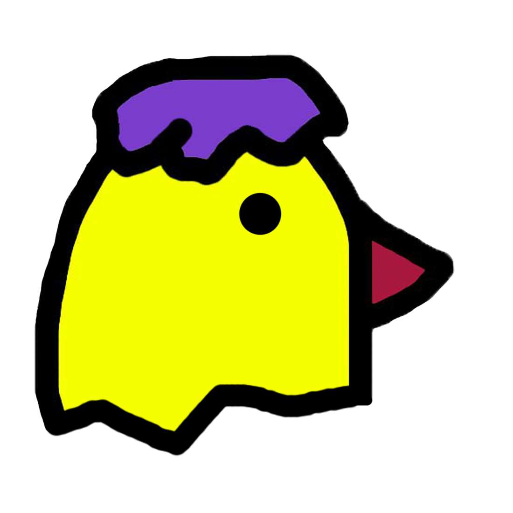

  <h1>
    
    Oriole
  </h1>
  
<a href="https://github.com/GoatWhistle/oriole/i18n/README_ru.md">Russian README</a> | <a href="#features">Features</a> | <a href="#tech-stack">Technologies</a> | <a href="#team"> Team</a> 

## 🚀 Modern Learning Collaboration Platform

**Oriole** bridges mentors and learners through intuitive task management and progress tracking, powered by a robust
technical stack.

#

## 🌟 Key Features

**Oriole** bridges mentors and learners through:

✔ **Group Management** - Create and organize learning groups with custom roles  
✔ **Modular Content** - Build structured learning modules with sequenced tasks  
✔ **Task Assignment** - Distribute exercises and projects to participants  
✔ **Participant Invitation** - Easy member onboarding with referral links  
✔ **Solution Submission** - Complete tasks with multi-format responses  
✔ **Moderation Tools** - Review and evaluate submitted work

### 🚀 Coming Soon:

• Automated task verification  
• Peer review system  
• Integration with e-learning standards (SCORM/xAPI)

#

## 🛠 Core Technologies

### Frontend

  

### Backend

  
  

### Data Layer

  
  
  
  

### Infrastructure

  
  
  

### Task Processing

  
  

### Dependency Management

  

#

## 👥 Our Team

<!-- Teamlead and DevOps -->

  

    
    

      <h3 style="margin: 0 0 5px 0; font-size: 1.2em; color: #c7d0ff;">Pupykin Timofey</h3>
      
Teamlead & DevOps

    

  

  

    

      ⟣ System Architecture 
      ⟣ Infrastructure Design 
      ⟣ CI/CD Pipelines
    

  

<!-- Backend Developer 1 -->

  

    
    

      <h3 style="margin: 0 0 5px 0; font-size: 1.2em; color: #c7d0ff;">Saveliev Artem</h3>
      
Backend Developer

    

  

  

    

      ⟣ API Development 
      ⟣ Performance Optimization 
      ⟣ Security Implementation
    

  

<!-- Backend Developer 2 -->

  

    
    

      <h3 style="margin: 0 0 5px 0; font-size: 1.2em; color: #c7d0ff;">Khorokhorin Mikhail</h3>
      
Backend Developer

    

  

  

    

      ⟣ API Development 
      ⟣ Database Design 
      ⟣ System Integration
    

  

<!-- Frontend Developer -->

  

    
    

      <h3 style="margin: 0 0 5px 0; font-size: 1.2em; color: #c7d0ff;">Savitskas Robert</h3>
      
Frontend Developer

    

  

  

    

      ⟣ UI/UX Design 
      ⟣ Interactive Components 
      ⟣ Frontend Architecture
    

  

